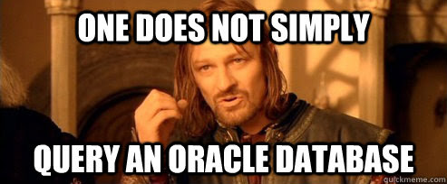

# Balíčky (Packages)
- seskupují subprogramy, proměnné, kursory a vyjímky

- skládá se z:
    - **specifikace** (specification)\
    \*header file\*
    - **těla** (body)\
    \*implementace\*
- části se kompilují zvlášt

## syntaxe
### specifikace
```sql
CREATE [OR REPLACE] PACKAGE název_balíčku IS|AS

veřejné proměnné, konstanty, kurzory, vyjímky, uživatelské typy a podtypy (*globální věci*)

veřejné procedury a/nebo funkce (*signatury*)

END [název_balíčku];
```
<span style="color:#888;">někdo asi zapomněl co za kód vlastně píše, když se dá dát název balíčku i na konec</span>

### tělo
```sql
CREATE [OR REPLACE] PACKAGE BODY název_balíčku IS|AS

soukromé typy, proměnné
[BEGIN inicializace (*konstruktor (statický)*)]

END [název_balíčku];
```
pozor na pořadí deklarace

specifikace může existovat bez těla, ale ne naopak

## Shrnutí
- enkaspsulace
- `OR REPLACE`
- tělo balíčku
- specifikace balíčku
- *Proč používáme balíčky?*

<div style="height: 2em; width: 100%; background: #8882; border-radius: 2em; margin: 2em;">
<center>
<span style="color:#000; font-weight: bold">vyplňovač místa</span>
</center>
</div>

<center></center>