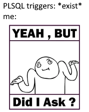

# Trigger
- automatická obsluha událostí
- nepřebírají parametry
- události na
    - DML
    - DDL
    - databázové události (přihlášení, vypnutí (DBA))
- typy
    - na úrovni řádku
    - na úrovní příkazu
- pozor nelze používat `COMMIT`, `SAVEPOINT`, `ROLLBACK`

## Zápis
událost na tabulce
```sql
CREATE [OR REPLACE] TRIGGER trigger_jmeno
{BEFORE | AFTER | INSTEAD OF} {INSERT | UPDATE | DELETE} ON tabulka_jmeno
BEGIN
    -- kód
END;
```

## Použití (např.)
- komplexní pravidla integrity

## Guidelines
- využívejte omezeních, ne triggerů
- pozor na komplexitu triggerů
- triggry by měli být stručné

---

<center>
    
</center>